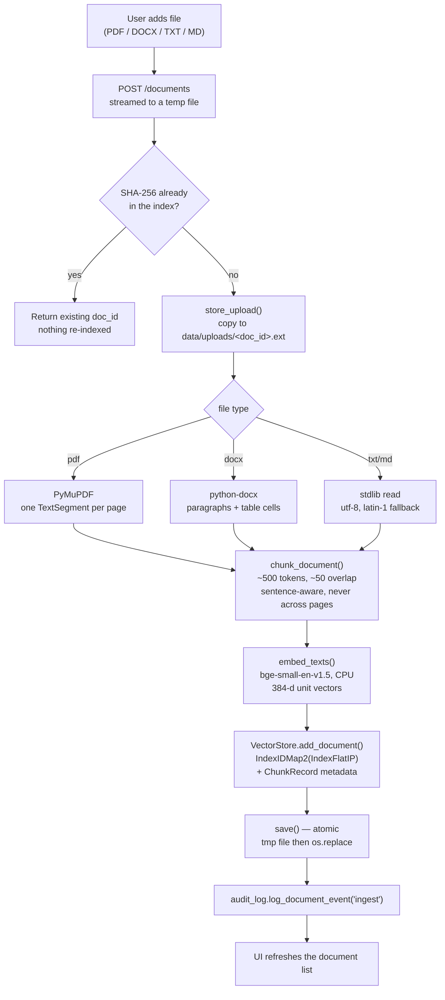
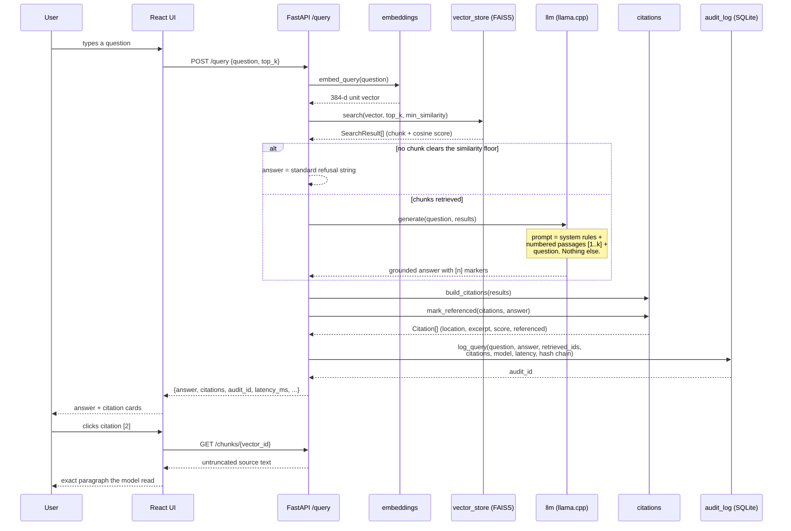

# Safe Insight — Architecture

Technical companion to the README. Written for documentation and viva defence:
every diagram is followed by the reasoning behind it.

---

## 1. System overview

Three processes, one machine, one permitted network hop.

```
┌───────────────────────────────────────────────────────────────────────┐
│  USER'S MACHINE  (nothing crosses this boundary)                      │
│                                                                       │
│  ┌─────────────────────────┐        ┌──────────────────────────────┐  │
│  │  Tauri 2 shell (Rust)   │        │  FastAPI backend (Python)    │  │
│  │  ───────────────────    │ spawn  │  ───────────────────────     │  │
│  │  • spawns/​supervises    │───────►│  127.0.0.1:8765              │  │
│  │    the Python process   │        │                              │  │
│  │  • hosts the webview    │        │  ┌────────────────────────┐  │  │
│  │                         │        │  │ network_guard          │  │  │
│  │  ┌───────────────────┐  │  HTTP  │  │ (socket patch, active  │  │  │
│  │  │ React UI          │  │  over  │  │  before any ML import) │  │  │
│  │  │ • documents       │◄─┼─loop───┼─►└────────────────────────┘  │  │
│  │  │ • chat            │  │  back  │                              │  │
│  │  │ • citations       │  │  only  │  ingestion → chunking →      │  │
│  │  │ • offline badge   │  │        │  embeddings → vector_store   │  │
│  │  └───────────────────┘  │        │  → llm → citations           │  │
│  └─────────────────────────┘        │  → audit_log                 │  │
│                                     └──────────────┬───────────────┘  │
│                                                    │                  │
│                          ┌─────────────────────────▼───────────────┐  │
│                          │  Local disk — backend/                  │  │
│                          │   models/llm/*.gguf       (~2 GB)       │  │
│                          │   models/embeddings/      (~130 MB)     │  │
│                          │   data/uploads/           originals     │  │
│                          │   data/index/*.faiss + metadata.json    │  │
│                          │   data/logs/audit.sqlite3               │  │
│                          └─────────────────────────────────────────┘  │
└───────────────────────────────────────────────────────────────────────┘
                                    ╳
                    no outbound sockets — enforced, not assumed
```

**Why two processes rather than one?** The ML stack (PyTorch, FAISS,
llama.cpp) is Python-native; reimplementing it in Rust would be a project in
itself. Tauri gives a small, native window without Electron's ~150 MB Chromium
runtime, and the process boundary means the backend can be exercised
independently with `curl` or `/docs` — which is how most of this scaffold was
debugged.

**Why HTTP over loopback rather than Tauri IPC?** The backend stays a plain,
testable web service. A future web or CLI client needs no backend changes, and
the request path is inspectable with ordinary tools. The cost is one open
loopback port, which is the one thing the kill-switch explicitly permits.

---

## 2. Ingestion data flow



**Key points to defend.**

- *Duplicate check before extraction.* Hashing costs milliseconds; extraction and
  embedding cost seconds. Ordering them this way makes a re-upload nearly free.
- *One segment per PDF page.* A chunk must belong to exactly one page or it
  cannot name a page in its citation. Chunking never merges across segments.
- *Atomic persistence.* Index and metadata are written to `.tmp` siblings and
  `os.replace`d. A crash mid-write leaves the previous good state, not a
  truncated index the app cannot open.
- *Incremental by construction.* `add_with_ids` appends; nothing is rebuilt.
  `remove_ids` deletes one document's vectors in place.

---

## 3. Query data flow



**The citation contract.** Passages are numbered `[1..k]` in the prompt, in
retrieval order. `Citation.index` uses the same numbering. So a `[2]` written by
the model resolves deterministically to citation 2, whose `vector_id` fetches the
exact stored text. This is a single invariant, and it is the whole differentiator:
break it and "cited" becomes decorative.

**Retrieved vs referenced.** All `top_k` chunks are shown, but those the model
actually cited are flagged and highlighted. The audit log stores both sets — an
auditor needs to see what the model *could* have used, not only what it did.

---

## 4. Module responsibilities

| Module | Owns | Deliberately does not |
|---|---|---|
| `config.py` | every path, tunable, and the offline env vars | any I/O beyond `mkdir` |
| `network_guard.py` | socket patching, self-check, violation log | know anything about RAG |
| `ingestion.py` | file → text segments, storage, hashing | chunking or embedding |
| `chunking.py` | segments → overlapping chunks + provenance | file formats or models |
| `embeddings.py` | text → normalised vectors | persistence |
| `vector_store.py` | FAISS index, metadata, incremental add/delete | embedding or prompting |
| `llm.py` | GGUF loading, grounded prompt, generation | retrieval or citation shaping |
| `citations.py` | results → verifiable citation trail | retrieval or generation |
| `audit_log.py` | SQLite log, hash chain, export | anything on the request path |
| `schemas.py` | wire formats | business logic |
| `main.py` | HTTP routes, orchestration, lifespan | algorithms |

The dependency graph is acyclic and shallow: `main` → everything;
`vector_store` → `ingestion` → `chunking`; `citations` and `llm` reference
`vector_store` types under `TYPE_CHECKING` only, so both are importable without
numpy or FAISS present. That is what lets the test suite run in 0.2 s with no
models installed.

---

## 5. The offline enforcement layers

```
Layer 3  Startup self-check          try connect 8.8.8.8:53 → must fail
         ────────────────────────    result served at /health/offline-check
              ▲
Layer 2  Socket monkey-patch         socket.connect / connect_ex /
         ────────────────────────    create_connection / getaddrinfo
                                     → non-loopback raises OutboundNetworkBlocked
              ▲
Layer 1  Environment                 HF_HUB_OFFLINE=1, TRANSFORMERS_OFFLINE=1
         ────────────────────────    local_files_only=True on every model load
              ▲
Layer 0  Architecture                no HTTP client in requirements.txt's
         ────────────────────────    runtime path; loopback bind; CORS allowlist
```

Order of installation matters and is enforced in `main.py`: `config` is imported
first (sets the env vars), then `network_guard.install_guard()` runs, and only
then is anything from the ML stack imported. A library that opens a socket in its
module-level initialiser is therefore still caught.

**Failing closed.** `_is_local_address` returns `True` only for values it can
positively identify as loopback. An address shape it does not recognise is
treated as remote and blocked.

**Why also patch `getaddrinfo`.** Blocking only `connect` means a leak manifests
as a DNS lookup followed by a socket timeout — slow and confusing. Blocking
resolution too makes the failure immediate and legible.

**Honest reporting.** `offline_verified` is `True` only when the guard is
installed, strict mode is on, the live probe was blocked, *and* the violation
count is zero. A single escape attempt anywhere in the process turns the badge
red and lists the destination.

---

## 6. Storage design

```
backend/data/
├── uploads/
│   └── <doc_id>.pdf            original files, named by UUID (not by user
│                               input, so a hostile filename cannot traverse)
├── index/
│   ├── safe_insight.faiss      IndexIDMap2(IndexFlatIP(384))
│   └── metadata.json           {version, dimension, embedding_model,
│                                next_vector_id, documents{}, chunks{}}
└── logs/
    └── audit.sqlite3           query_log (hash-chained) + document_log
```

**Three stores, three access patterns.** FAISS handles similarity search and
nothing else. The JSON sidecar holds chunk text and provenance — small,
human-readable, and diffable, which matters when an examiner asks to see the
citation trail on disk. SQLite handles the append-heavy, durability-sensitive
audit log. Merging them would mean one of the three jobs is done badly.

**Vector ids are monotonic and never reused.** `next_vector_id` only increases,
so a stale id in an old audit record can never silently resolve to a different
chunk after a delete.

**Metadata versioning.** `METADATA_VERSION` is checked on load. A shape change
fails loudly with an actionable message rather than mis-parsing old state.

### Audit hash chain

```
record_hash(n) = SHA256( record_hash(n-1) ‖ canonical_json(record n) )
record_hash(0) = SHA256( "000...0" ‖ canonical_json(record 1) )
```

`canonical_json` sorts keys, so the hash is stable across Python versions and
dict ordering. `GET /audit/verify` re-computes the chain from row 1 and reports
the first mismatch by id. Tested in `tests/test_smoke.py::test_audit_chain_detects_tampering`,
which edits a row with raw SQL and asserts the break is located.

---

## 7. Performance notes

Measured expectations on the target machine (8 GB RAM, 4-core CPU, no GPU):

| Operation | Typical | Dominated by |
|---|---|---|
| Backend cold start | 5–20 s | loading the GGUF into RAM |
| Embedding model load | 3–5 s | PyTorch import + weights |
| Ingest a 20-page PDF | 3–8 s | embedding ~40 chunks |
| Retrieval (10k vectors) | < 5 ms | exact FAISS scan |
| Generation, 300 tokens | 8–25 s | CPU inference, the bottleneck |
| Audit write | < 5 ms | `synchronous=FULL` fsync |

**Consequences designed around.** Generation dominates everything else, which is
why `warm_up()` runs at startup (so the *first* question is not also the slowest),
why `temperature` is 0.2 and `max_tokens` 512 (no rambling on a CPU budget), and
why streaming is the top item on the "next steps" list — it changes perceived
latency far more than any retrieval optimisation would.

**Where the scale ceiling is.** `IndexFlatIP` is O(n) per query. At ~1M vectors
(roughly 20,000 documents) a flat scan starts to be noticeable and an IVF index
becomes worth its complexity. Below that it is the wrong trade.

---

## 8. Threat model (brief)

| Threat | Mitigation | Residual risk |
|---|---|---|
| Document content leaving the machine | socket guard, offline env, no HTTP client on the runtime path | a native library bypassing Python's socket module (llama.cpp and FAISS open no sockets) |
| Another machine reaching the backend | loopback bind + CORS allowlist | none from the network; a local process can still reach 8765 |
| Malicious filename (path traversal) | stored as `<uuid><ext>`; user input never forms a path | — |
| Tampering with the audit log | hash chain + `/audit/verify` | a user with the source can recompute the chain |
| Prompt injection inside a document | system prompt constrains scope; citations expose the source text | a small model can still be steered by hostile text in a passage |
| Malicious model file | models come from named repos and the path is explicit | user-supplied GGUF is trusted by construction |

Prompt injection is the honest weak point and worth naming in a viva: the
citation trail *surfaces* it (the user can read the passage that misled the
model) but does not prevent it.

---

## 9. Testing strategy

`backend/tests/test_smoke.py` — 18 tests, ~0.2 s, no models required:

- **chunking** — size bounds, sequential gap-free indices, page inheritance,
  punctuation-free text, empty input, whitespace normalisation
- **citations** — marker extraction (`[1]`, `[1, 3]`, `[2][4]`, repeats),
  location formatting with and without page numbers, word-boundary truncation
- **audit log** — round-trip, newest-first ordering, chain validity, tamper
  detection with an explicit `UPDATE`, JSONL export
- **network guard** — outbound connect blocked, loopback still allowed, remote
  DNS blocked, status payload correct

Deliberately excluded: anything requiring FAISS, PyTorch or a 2 GB GGUF. Those
turn a one-second check into a multi-gigabyte prerequisite. The natural next
layer is a FastAPI `TestClient` suite with a stubbed embedder — the seam already
exists, since `embeddings` is the only module the vector store depends on for
dimension.

---

## 10. Deployment path (stretch goal)

Current v1 spawns the system Python from `src-tauri/src/main.rs`, which the brief
explicitly permits. The route to a double-click installer:

1. `pyinstaller --onedir --name safe-insight-backend app/main.py`
2. Copy the result to `src-tauri/binaries/` with Tauri's platform-triple suffix
   (e.g. `safe-insight-backend-x86_64-pc-windows-msvc.exe`).
3. Declare it under `bundle.externalBin` in `tauri.conf.json`, add
   `shell:allow-execute` to `capabilities/default.json`, and replace the
   `std::process::Command` call with Tauri's sidecar API.
4. Ship the models separately — a first-run downloader, or a second installer.
   They must not go inside the bundle: 2 GB of weights in an installer is
   unreasonable, and their licences differ from the application's.

Model distribution is the genuinely awkward part of shipping offline AI, and
saying so is a better answer than pretending it is solved.
